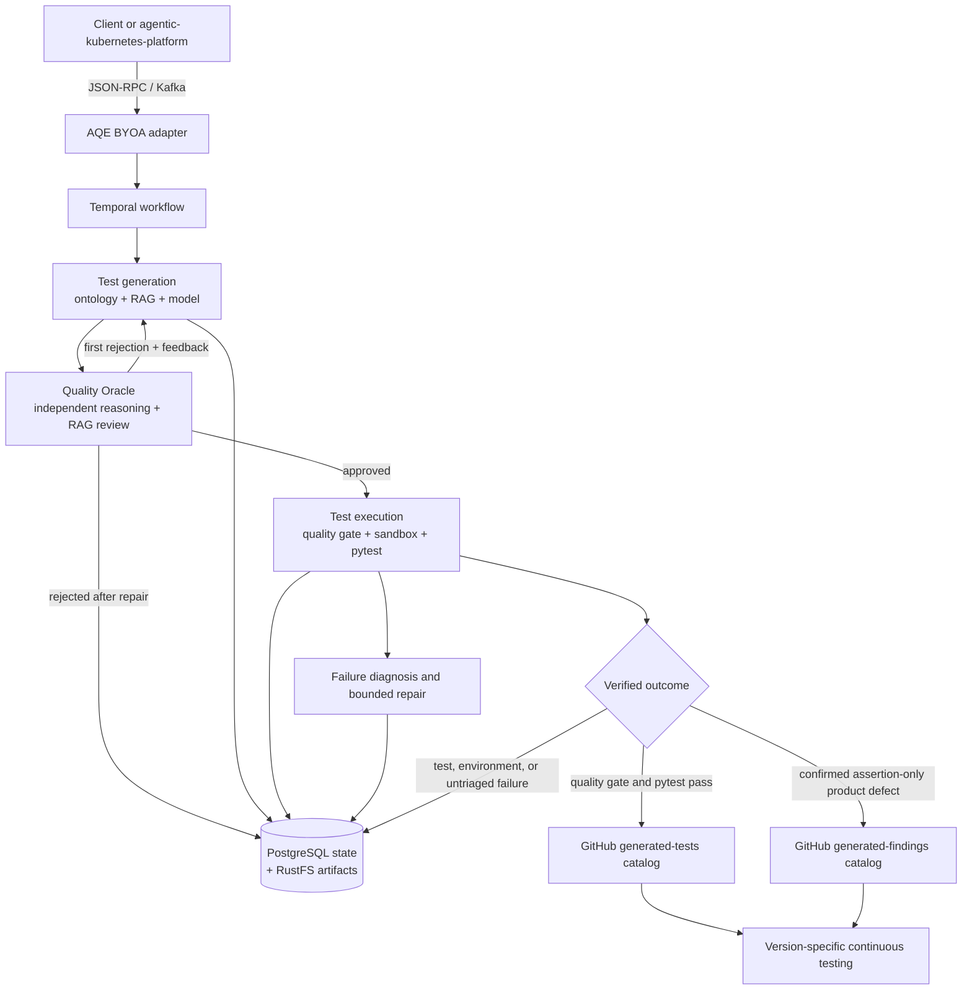
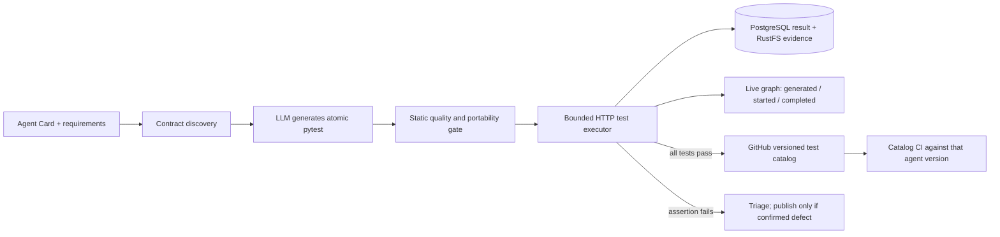
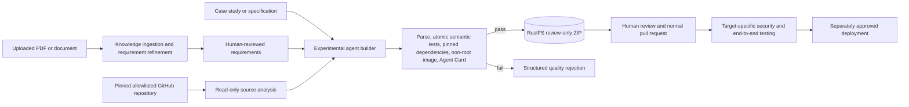
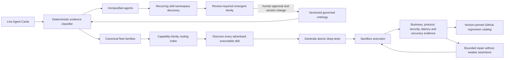
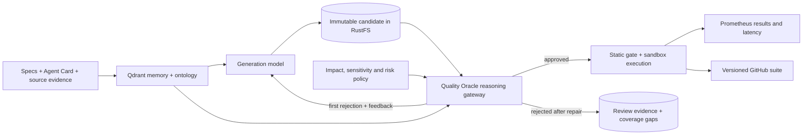

# AQE — Agentic Quality Engineering

AQE is a **compound agent system** that turns product context and observed UI
state into generated tests, executes them in a bounded sandbox, diagnoses
failures, and optionally repairs and re-runs the tests. The public role is the
**QE orchestrator**; “umbrella agent” and “thick agent” are understandable but
are not standard architecture terms.

See [Architecture and operating rules](docs/architecture.md) for the complete
Temporal rules, Mermaid flow diagrams, deployment procedures, BYOA protocol,
and internal/external agent examples. Use the
[agent testing runbook](docs/testing-agents.md) to test current AQE agents or
onboard a new internal or external agent.

## Architecture



PostgreSQL and RustFS are the complete operational evidence store; they retain
every candidate, attempt, result, and large artifact. GitHub is the durable,
reviewable terminal catalog for **promoted** assets only: validated green tests
and explicitly confirmed defect reproducers. Unvalidated model output and
ordinary failures are never committed merely to make the catalog exhaustive.

### Ownership boundaries

| Layer | Responsibility |
|---|---|
| BYOA adapter | Platform Agent Card, registry refresh, `tasks.aqe` / `results.aqe`, result-before-offset-commit |
| Temporal | Durable generate → execute → repair coordination |
| Generation agent | Product RAG + agent-ontology-grounded pytest source and immutable test artifact |
| Quality Oracle | Independent pre-execution review against requirements, ontology, RAG evidence, skill coverage, and risk policy |
| Agent executor | Browser-free HTTP/Agent Card/A2A tests in an isolated bounded runtime |
| Website executor | Playwright Chromium journeys in a separate browser runtime |
| Repair client | At most `MAX_REPAIR_ATTEMPTS`; preserve expected behavior and never weaken assertions |
| Diagnostics agent | Fleet Agent Card checks, skill contract probes, safe retries, and recovery recommendations |
| PostgreSQL / RustFS | Test-run state, source, repaired artifacts, output, and audit evidence |
| GitHub catalogs | Versioned validated tests and confirmed issue reproducers that continuously test a specific target version |

Generated code is never silently changed before its first run. The old executor
rewrote URLs, expected strings, and locator strictness, which could manufacture
false passes; that behavior has been removed.

## Test quality policy

Every generated test must:

- verify one observable outcome with one assertion or Playwright `expect`;
- use fixtures for shared setup and cleanup;
- use role/label/test-id locators and explicit state waits;
- remain independent of execution order;
- preserve expected values during repair;
- avoid fixed sleeps, swallowed failures, and conditional assertion skipping.

The AST quality gate enforces the atomic-outcome rules before execution. Pytest
exit status and JUnit XML—not output-string matching—determine the result.

When `TEST_CATALOG_REPOSITORY` and `TEST_CATALOG_GITHUB_TOKEN` are configured,
execution commits immutable Python tests and metadata to
`generated-tests/<runtime>/<layer>/<agent>/<release-version>/<git-revision>/` on `TEST_CATALOG_BRANCH`. This lets CI test
specific versions of teaching, listening, finance, insurance, or any other
agent without encoding profession-specific behavior into AQE. Keep the catalog
repository private when scenarios or expected outcomes contain sensitive data.
When the catalog is this repository, `.github/workflows/generated-tests.yml`
runs the generated branch automatically with read-only GitHub permissions.
The resulting GitHub URL is written back to the PostgreSQL run record, linking
operational evidence to its reviewable, version-controlled test.

Confirmed product defects are also durable GitHub artifacts, but ordinary test
failures are not. After triage, `POST /v1/findings/<task-id>/confirm` reruns the
test without repair and requires non-empty evidence. Only assertion failures
with zero execution/collection errors are published to
`generated-findings/<test-type>/<agent>/<version>/`. CI verifies each finding
continues to reproduce; a newly passing reproducer signals that the defect was
fixed and the catalog should be updated.

## Local development

```bash
docker compose up --build
```

Endpoints:

- dashboard: <http://localhost:3000>
- execution: <http://localhost:8003/health>
- website execution: <http://localhost:8013/health>
- durable workflow API: <http://localhost:8008/docs>
- BYOA discovery: <http://localhost:8009/.well-known/agent.json>
- diagnostics and external agent probes: <http://localhost:8006/docs>
- experimental agent builder: <http://localhost:8015/docs>
- review-only dbt builder: <http://localhost:8016/docs>
- Quality Oracle gateway: <http://localhost:8017/docs>
- Temporal UI: <http://localhost:8233>

Start a durable run:

```bash
curl -s http://localhost:8008/v1/qe-runs \
  -H 'content-type: application/json' \
  -d '{"url":"https://example.com","test_type":"website","spec":"Verify the primary user flow","repair":true}'
```

The dashboard includes **LOAD AGENT EXAMPLE** and **LOAD WEBSITE EXAMPLE**.
Generation requires either a self-hosted OpenAI-compatible embedding/completions
service or Gemini configuration in `aqe-runtime-secrets`:

```yaml
stringData:
  LLM_PROVIDER_MODE: SELF_HOSTED
  LLM_EMBEDDING_ENDPOINT: http://your-model-service/v1/embeddings
  LLM_GENERATION_ENDPOINT: http://your-model-service/v1/completions
```

For Gemini, set `LLM_PROVIDER_MODE: GEMINI` and `GEMINI_API_KEY` instead. Restart
`aqe-test-generation` after changing the Secret. Without model configuration,
the workflow now fails immediately with a visible configuration error rather
than timing out. Product RAG data is optional; ontology and scenario grounding
remain active when no product-knowledge artifact has been ingested.

The dashboard displays the active generation provider, sanitized model name,
connectivity, and probe latency. The probe validates provider access without
generating content and never returns the endpoint or API key. Override
`GEMINI_GENERATION_MODEL` or `GEMINI_EMBEDDING_MODEL` when using a different
available Gemini model.

The UI polls `GET /v1/qe-runs/<workflow-id>` until completion and shows the
result or root failure. GitHub source grounding is optional. If used, enter
`owner/repository` (or a GitHub URL) plus a commit/tag and add that repository to
`config.githubSourceAllowedRepositories`.

### What happens after testing an existing agent

Submitting an agent run is not only a prompt check. AQE performs and records this
pipeline:



For example, load **LOAD AGENT EXAMPLE** in the UI or follow the diagnostics
agent command in [`docs/testing-agents.md`](docs/testing-agents.md). The initial
response contains an accepted `workflow_id`; poll it until Temporal finishes:

```bash
curl -s "http://127.0.0.1:18008/v1/qe-runs/$workflow_id" | jq \
  '{status,successful:.result.successful,summary:.result.summary,catalog:.result.test_catalog,error:.result.error}'
```

Interpret the result as follows:

- `status: COMPLETED` means durable orchestration finished, not necessarily that
  pytest passed. Require `result.successful: true` and zero failures/errors.
- A successful run stores the generated `.py` test and metadata `.json` under
  `generated-tests/agent/<layer>/<agent>/<release-version>/<git-revision>/` on `TEST_CATALOG_BRANCH`.
- That catalog push starts **Versioned agent E2E catalog**. Its runner must reach
  the tested version through `AGENT_CARD_URL`/`AGENT_BASE_URL`; local or private
  targets require a self-hosted runner selected by `E2E_RUNNER`.
- A product assertion failure remains evidence in PostgreSQL/RustFS for triage.
  It is stored under `generated-findings/` only after explicit defect
  confirmation; infrastructure, collection, and authentication errors are never
  cataloged as product defects.
- The dashboard's Observe tab provides separate Graph and 3D views of directed agent handoffs, generated
  test nodes, final status, target relationships, and Temporal workflow history.

The generated catalog is therefore a versioned regression suite, not merely an
archive. Future releases rerun applicable tests against the configured endpoint.

In **01 / DISCOVER**, leave Agent Card URL blank and click
**DISCOVER ALL CONFIGURED AGENTS** to crawl the configured AQE fleet and its
bounded orchestration links. Enter a URL and click **DISCOVER CARD** to inspect
one internal or external agent instead. Discovery designs scenarios and reports
missing semantic oracles; use **03 / EXECUTE** to generate and execute
the resulting tests.

**AUTOPILOT MODE** correlates runtime Agent Cards with `agent.yaml` manifests
found through the governed GitHub MCP connector in every allowlisted connected
repository. It source-grounds matched agents, derives protocol/declared-skill
scenarios, generates and quality-gates atomic pytest, executes and repairs,
persists evidence, updates the live graph, and catalogs passing tests in one
durable Temporal campaign. A repository manifest without a reachable Agent Card
is reported as `endpoint_required` and is not falsely marked tested. Child runs
are intentionally bounded to one at a time by default to protect the model
endpoint and serialize GitHub catalog writes. Closing the browser does not stop
the accepted campaign; its fleet workflow ID remains queryable through
`GET /v1/qe-runs/<workflow-id>`.

Each passing child writes a generated test and metadata commit directly to the
machine-managed `TEST_CATALOG_BRANCH`; it does not open one PR per agent. The UI
shows direct file and commit links in the campaign result. Promote a reviewed
campaign to `main` with one human-owned catalog PR rather than creating fleet PR
spam. Failed infrastructure runs are not committed, and product failures require
explicit confirmation before entering `generated-findings/`.

To ground agent testing in its implementation, configure a read-only fine-grained
GitHub token and an explicit repository allowlist, then include a commit, tag,
or version ref in the run:

```bash
export GITHUB_SOURCE_ALLOWED_REPOSITORIES=sqe/example-agent
export GITHUB_SOURCE_TOKEN=github_pat_read_only
curl -s http://localhost:8008/v1/qe-runs \
  -H 'content-type: application/json' \
  -d '{"url":"https://agent.example/rpc","test_type":"agent","source_repository":"sqe/example-agent","source_ref":"a1b2c3d","spec":"Validate declared skills"}'
```

The source-analysis agent reads at most 30 allowlisted source files and 500 KB,
records blob/tree SHAs, and emits candidate line-level findings. The generation
model uses those candidates to design black-box reproductions. They do not
become confirmed defects until execution and the explicit finding gate pass.

For MCP-based GitHub access, deploy the `github-connector` agent with a dedicated
fine-grained token. It connects to GitHub's official Streamable HTTP MCP server,
discovers tools with `tools/list`, and permits only configured tools and source
repositories. Use the read-only repos endpoint for source inspection:

```bash
kubectl -n aqe patch secret aqe-runtime-secrets --type merge -p '{
  "stringData": {
    "GITHUB_MCP_URL": "https://api.githubcopilot.com/mcp/x/repos/readonly",
    "GITHUB_MCP_TOKEN": "github_pat_read_only",
    "GITHUB_MCP_ALLOWED_TOOLS": "get_file_contents,get_commit,list_branches,search_code"
  }
}'
kubectl -n aqe rollout restart deployment/aqe-github-connector
```

The connector is the credential and policy boundary; generation and execution
agents must not receive the MCP token. Configure a separate write-scoped
connector before enabling branch, file, or pull-request tools.

Configure repair with an OpenAI-compatible chat-completions endpoint:

```bash
export REPAIR_LLM_URL=http://host.docker.internal:8081/v1/chat/completions
export REPAIR_LLM_MODEL=your-model
```

## agentic-kubernetes-platform BYOA

Yes—AQE can be brought into the platform as one compound specialist. Do not
expose every internal worker as a platform agent. Configure the adapter to use
the platform registry and Kafka:

```bash
export PLATFORM_REGISTRY_URL=http://platform-agentic-platform-registry.agentic-platform.svc:8001
export PLATFORM_KAFKA_BOOTSTRAP_SERVERS=kafka.messaging.svc:9092
```

Published skills are:

- `qe.run`: start the durable end-to-end workflow;
- `qe.validate`: run a persisted test without repair;
- `qe.repair`: diagnose, repair, and re-run a persisted test.

The adapter accepts native platform JSON-RPC and Model Fleet's `tasks.execute`
envelope, publishes correlated results, and commits Kafka input only after the
result is published.

## Agentic QE automata and agent contract testing

“Agentic QE automaton” is a useful product name for AQE: the standard technical
description remains a **compound agent system** with a durable workflow/state
machine. The diagnostics agent validates all internal Agent Cards after every
Argo CD sync and supports contract probes for known agents on internal or
external networks:

```bash
curl -s http://localhost:8006/v1/agent-probes \
  -H 'content-type: application/json' \
  -d '{"card_url":"https://agent.example/.well-known/agent.json","expected_skills":["research.run"]}'
```

External hosts must be explicitly added to `AGENT_PROBE_ALLOWED_HOSTS` (or the
Helm `config.agentProbeAllowedHosts` value). An optional `invocation` object can
exercise a JSON-RPC scenario after its Agent Card and skills pass. “Safe heal”
retries transient checks and returns remediation guidance; it intentionally
does not restart workloads or mutate clusters without a separate authorized
platform operation.

## Continuous evaluation

The release suite contains 105 cases: 100 semantic cases spanning 20 agent
professions and five quality dimensions, plus five generation/repair checks.
Positive and adversarial examples check domain accuracy, uncertainty, safety,
protocol behavior, orchestration, atomic tests, stable waiting, and preservation
of expected values.

```bash
python evaluation/run.py --minimum-score 1.0
EVAL_MODEL_URL=https://model.example/v1/chat/completions \
  EVAL_MODEL_NAME=my-model python evaluation/run.py --live --minimum-score 0.8
```

CI validates the dataset on every change. A scheduled workflow and every
SemVer release run it in 10 parallel shards. Configure `EVAL_MODEL_URL`,
optional `EVAL_MODEL_API_KEY`, and `EVAL_MODEL_NAME` for live inference; without
them the workflow validates the golden corpus and scorers offline. Set
`EVAL_RESULTS_URL` to the diagnostics agent's `/v1/evaluations` endpoint to
publish shard score, semantic score, case count, and latency to Prometheus and
the **AQE Release Quality** Grafana dashboard. A model served only on a private
LAN, such as `192.168.x.x`, requires a GitHub self-hosted runner on that network.
Register it with the custom label `aqe-model` and set the repository variable
`EVAL_RUNNER=aqe-model` to route only model
evaluation there; all normal CI and image builds remain on GitHub-hosted Linux.

## Experimental builders

The **experimental agent builder** turns a case study/specification, refined
document requirements, or a pinned allowlisted GitHub repository into a minimal
Python agent bundle with semantic tests, a non-root Dockerfile, exact
dependencies, and an Agent Card. Upload PDF/DOCX/TXT/Markdown to knowledge
ingestion first; review its refined requirements, then pass those requirements
to `/v1/builds`. Raw PDFs are not sent directly to generated code. `dbt-builder`
turns an explicit warehouse source inventory and business definitions into a
documented staging → intermediate → marts dbt project with data tests. Both
apply static gates, write ZIP evidence to RustFS, return `REVIEW_REQUIRED`, and
never execute, deploy, or connect generated code to a warehouse.



```bash
curl -s http://localhost:8015/v1/builds -H 'content-type: application/json' \
  -d '{"spec":"A teaching agent that explains a concept and cites its supplied lesson."}'

curl -s http://localhost:8016/v1/missions -H 'content-type: application/json' \
  -d '{"dialect":"snowflake","goals":"Daily completed-order revenue by customer","sources":[{"name":"orders","columns":["id","customer_id","status","amount","created_at"]}]}'
```

These are design accelerators, not autonomous production publishers. Human
review, target-specific execution, security checks, and normal pull-request
controls remain mandatory.

## Agent ontology and live graph

The versioned ontology at `ontology/agent_ontology.json` describes agent
interfaces, autonomy, sensitivity, impact, archetypes, and risk overlays. The
knowledge-ingestion agent stores it in Qdrant and RustFS without deleting
product knowledge. The generator combines deterministic applicable ontology
rules with retrieved product evidence, so teaching, listening, finance,
insurance, healthcare, action, research, and orchestration agents receive
different obligations without hard-coded test implementations. The stable
`software_quality_engineering` archetype is presented in the product as
**AI Buster**. It requires positive, protocol/schema, malformed-input, latency,
semantic-oracle, repair-integrity, and versioned-regression scenarios.



The dynamic overlay discovers fleet patterns at runtime but cannot mutate the
governed ontology. AQE generates required dimensions for 100% of advertised
**executable** skills. Missing invocation contracts or semantic oracles remain
visible coverage gaps; AQE does not invent expected answers or claim that
undocumented behavior is fully correct.

## Quality Oracle and enhanced LLM gateway

Generated tests pass through `quality-oracle` before sandbox execution. The
oracle reads the immutable test artifact from RustFS and reviews it against the
original specification, refined requirements, discovered skill scenarios,
source evidence, applicable ontology, and the exact Qdrant RAG chunks used for
generation. It returns structured `APPROVED` or `REJECTED` evidence; malformed,
unavailable, or ambiguous review responses fail closed.

Complete machine-readable contracts use deterministic contract compilers when
available. The GitHub MCP connector compiler produces atomic skill, schema,
malformed-input, latency, and semantic tests without generation-model tokens;
the independent Oracle still reviews the compiled artifact before execution.



The gateway supports OpenAI-compatible self-hosted endpoints, including Qwen,
and Gemini. Standard workloads may reuse the configured generation endpoint.
High-impact, health, financial, regulated, or safety-critical workloads require
a separately configured oracle endpoint or model by default so generation does
not grade itself:

```yaml
stringData:
  LLM_GENERATION_ENDPOINT: http://192.168.1.21:1234/v1/chat/completions
  LLM_GENERATION_MODEL: qwen3.8-27b
  ORACLE_PROVIDER_MODE: SELF_HOSTED
  ORACLE_GENERATION_ENDPOINT: http://your-independent-model/v1/chat/completions
  ORACLE_GENERATION_MODEL: your-reasoning-model
  ORACLE_REASONING_EFFORT: high
```

Set `ORACLE_REQUIRE_INDEPENDENT_MODEL_FOR_HIGH_IMPACT=false` only for local
experimentation. Production high-impact releases should retain the default.

The dashboard's live graph follows the neighboring platform knowledge-graph
visualizer contract (`nodes`, `edges`, `stats`). It displays AQE agents,
infrastructure, discovered internal/external targets, versions, skills, and
ontology classes. Every generation emits a test node and animated routing edges
to the correct HTTP or browser executor.

## CI/CD and Argo CD

- `.github/workflows/ci.yml`: validates PRs, synthetic merge-queue integration
  commits, and protected `main`; automatic docs, config, and code lanes keep
  lightweight changes fast while code/refactor changes retain compile, unit,
  golden evaluation, contract, affected-image, and runtime E2E coverage.
- `.github/workflows/release.yml`: builds and publishes versioned GHCR images and
  packages the Helm chart; a tag cannot become a GitHub Release until all ten
  live model-evaluation shards and the disposable integration/telemetry gate
  pass. Published images include provenance and SBOM attestations. Configure the
  optional `RELEASE_SLACK_WEBHOOK_URL` secret for release-channel results.
- `.github/workflows/promote-release.yml`: the approved promotion entry point.
  It verifies the immutable candidate images running in Kubernetes, model
  connectivity, a fully passing Autopilot workflow, and green CI at the current
  `aqe-generated-tests` branch head before creating the final SemVer tag.
- [`docs/production-release.md`](docs/production-release.md): scalable
  trunk-based merge queue, immutable candidates, SemVer promotion, verification,
  and rollback checklist.
- `deploy/argocd/project.yaml` and `application.yaml`: scoped source/destination,
  automated prune/self-heal, retry policy, server-side apply, and independent
  Argo CD Image Updater digest tracking for every agent.
- `deploy/helm/aqe/templates/preflight.yaml`: a PreSync diagnostic hook that
  blocks rollout when PostgreSQL, RustFS, Kafka, Temporal, or the configured model
  endpoint is unavailable, plus a PostSync check for every AQE Agent Card.

Every deployable agent owns `agents/<agent>/{app.py,Dockerfile,requirements.txt,agent.yaml}`.
The [agent documentation index](agents/README.md) links each runtime's contract
and Mermaid data-flow diagram.
The two execution agents are distinct image and policy boundaries: HTTP/A2A
tests do not carry a browser, while website tests use the official Playwright
runtime. Install the Argo CD project and application after providing
`aqe-runtime-secrets` through your secret-management system:

```bash
kubectl apply -f deploy/argocd/project.yaml -f deploy/argocd/application.yaml
```

The application selects `values-agentic-platform.yaml`, which uses the
neighboring platform's `agentic-platform`, `messaging`, `temporal`, and `rustfs`
service DNS names. Local rendering does not mutate that cluster.

`aqe-runtime-secrets` must be created by the cluster's secret manager. At
minimum it supplies `POSTGRES_URL`, RustFS-compatible `AWS_ACCESS_KEY_ID` and
`AWS_SECRET_ACCESS_KEY`, and `QDRANT_API_KEY`. Add scoped `GITHUB_PAT`,
`GITHUB_SOURCE_TOKEN`, or `TEST_CATALOG_GITHUB_TOKEN` only when those GitHub
capabilities are enabled; none belong in Helm values.

Never commit model keys, database passwords, or registry credentials. The chart
references an optional Secret and keeps credentials out of the repository.

## Verification

```bash
python -m pytest -q test/test_quality.py test/test_byoa_adapter.py test/test_evaluation.py
python evaluation/run.py --minimum-score 1.0
helm lint deploy/helm/aqe
helm template aqe deploy/helm/aqe >/dev/null
docker compose config --quiet
test/e2e/run.sh
```

For production, run generated tests in one disposable Kubernetes Job per attempt
with a read-only root filesystem, seccomp, no service-account token, strict
resource quotas, and an egress policy limited to the system under test. The
current Compose subprocess sandbox is bounded and secret-scrubbed, but a
container is the local security boundary—not the Python subprocess alone.
