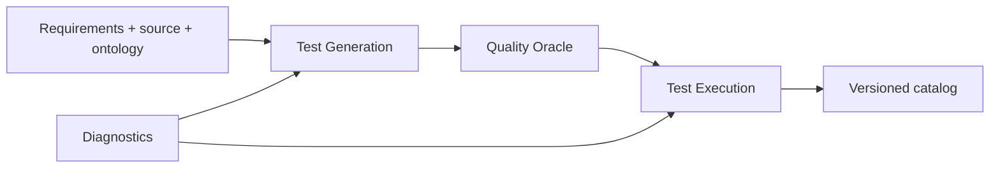

# AQE agents

Each directory is an independently versioned deployment boundary and owns its
entrypoint, dependencies, container image, `agent.yaml` contract, Agent Card,
and documentation. Shared protocol/storage code remains in `utils/`; control-plane
services remain outside this directory. Follow the links below for each runtime's
executable skills and data flow.

Image names match directory names: `ghcr.io/sqe/aqe-<directory>:<version>`.
The agent-test and website-test execution images intentionally share execution
logic, but the website image alone contains Playwright and Chromium.

| Agent | Responsibility |
|---|---|
| [Agent Builder](agent_builder/README.md) | Review-only agent bundles |
| [Artifact Management](artifact_management/README.md) | Object and metadata persistence |
| [Change Detection](change_detection/README.md) | Change-triggered orchestration |
| [dbt Builder](dbt_builder/README.md) | Review-only analytics projects |
| [Diagnostics](diagnostics/README.md) | Fleet contracts, health, and graph |
| [GitHub Analysis](github_analysis/README.md) | Pinned source evidence |
| [GitHub Commit](github_commit/README.md) | Generated catalog publication |
| [GitHub Connector](github_connector/README.md) | Governed MCP access |
| [Knowledge Ingestion](knowledge_ingestion/README.md) | Requirements, RAG, and ontology |
| [Quality Oracle](quality_oracle/README.md) | Independent generated-test review |
| [Test Execution](test_execution/README.md) | HTTP/A2A sandbox execution |
| [Test Generation](test_generation/README.md) | Contract compilation and model generation |
| [Webpage State Capture](webpage_state_capture/README.md) | Browser context capture |
| [Website Execution](website_execution/README.md) | Playwright sandbox execution |

