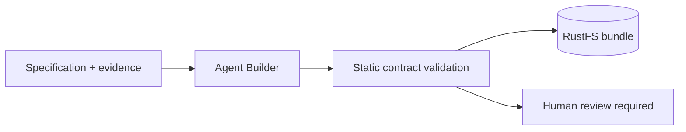

# Agent Builder

Creates review-only agent source bundles from requirements and pinned evidence. Generated bundles are validated and stored for human review; this agent never deploys them.

**Contract:** `agent.build.experimental` · `POST /v1/builds` · port `8015`.

Dependencies: source analysis, generation model, and RustFS. See the root README for runtime secrets and the production release guide for promotion policy.
