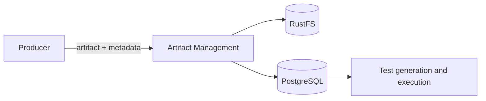

# Artifact Management Agent

Persists immutable AQE artifacts in RustFS and their searchable metadata in PostgreSQL.

**Contract:** `upload_artifact` · A2A task execution · port `8007`.

Uploads are side-effecting. Integration tests must use unique object paths and disposable metadata rather than shared release evidence.
