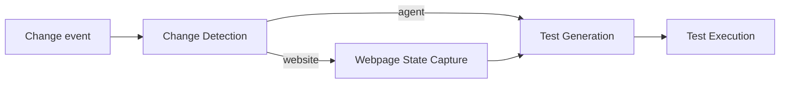

# Change Detection Agent

Consumes change signals, captures the appropriate target context, and dispatches the correct AQE generation and execution path.

**Contract:** `detect_change_and_orchestrate` · `POST /detect_changes` · port `8000`.

Dependencies: Kafka, Redis, generation, state capture, and execution. Positive smoke tests create workflows and therefore belong in an isolated candidate environment.
