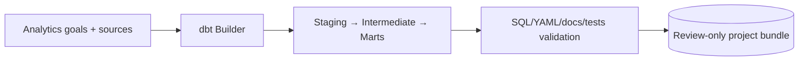

# dbt Builder Agent

Builds and validates review-only dbt projects with staging, intermediate, marts, documentation, and data-test coverage.

**Contracts:** `dbt.blueprint.build`, `dbt.project.validate` · port `8016`.

The Agent Card contains executable examples. Generated projects are never deployed automatically.
