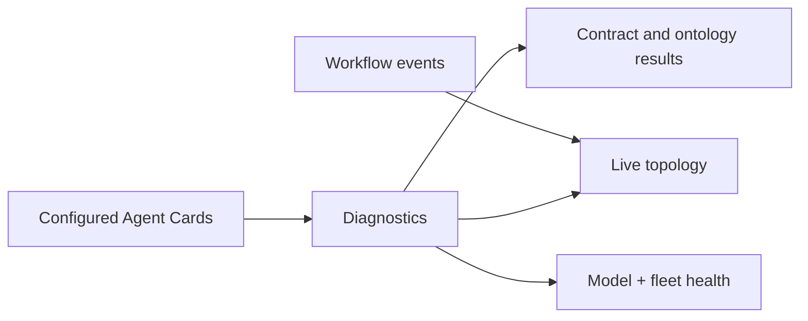

# Diagnostics Agent

Discovers Agent Cards, validates declared skills, classifies fleet capabilities, records live graph events, and reports safe remediation guidance.

**Contracts:** `diagnostics.scan`, `diagnostics.probe`, `diagnostics.heal` · port `8006`.

External probes are restricted by `AGENT_PROBE_ALLOWED_HOSTS`; diagnostics never turns an undeclared contract into a pass.
