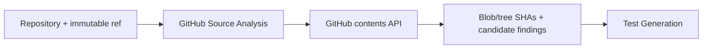

# GitHub Source Analysis Agent

Reads bounded files from allowlisted repositories and produces pinned source evidence for black-box test design.

**Contract:** `source.inspect` · `POST /v1/analyze` · port `8010`.

Access is read-only and bounded by repository allowlists, file count, and byte limits. Candidate findings are not confirmed defects.
