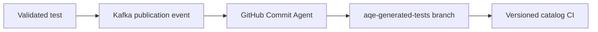

# GitHub Commit Agent

Consumes validated catalog publication requests and commits versioned generated tests through the governed GitHub boundary.

**Contract:** `start_commit_consumer` · port `8011`.

Only quality-gated passing tests are cataloged. Confirmed findings follow a separate explicit triage path.
