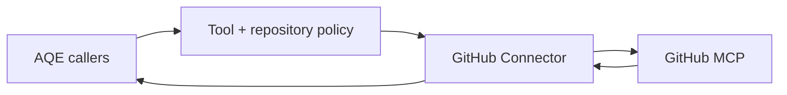

# GitHub Connector Agent

Provides an allowlisted boundary around GitHub's MCP server for source discovery and safe tool calls.

**Contracts:** `github.tools.list`, `github.tools.call` · port `8014`.

The Agent Card declares executable list and call scenarios. Tokens stay in the connector; generated tests receive no GitHub credential.
