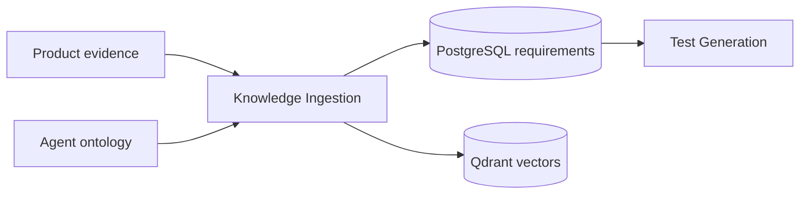

# Knowledge Ingestion Agent

Extracts testable requirements, versions product knowledge, and loads ontology/RAG records used to ground generation.

**Contracts:** `ingest_knowledge`, `ingest_ontology` · port `8004`.

Ingestion writes versioned state. Tests use disposable documents and must not replace active production knowledge.
