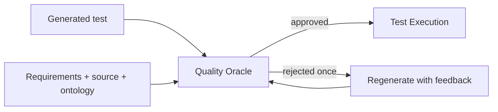

# Quality Oracle Agent

Independently reviews generated tests against declared requirements, source evidence, risk policy, and coverage before execution.

**Contract:** `oracle.review.generated_test` · `POST /v1/reviews` · port `8017`.

The Oracle fails closed and may require an independent model for high-impact workloads. It never converts missing evidence into a pass.
