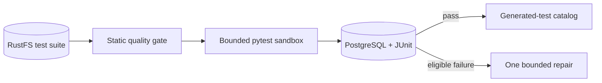

# Agent Test Execution

Runs quality-gated HTTP/A2A pytest suites in a bounded sandbox, persists JUnit evidence, and catalogs passing suites.

**Contracts:** `qe.validate`, `qe.repair` · `POST /run_tests` · port `8003`.

This image intentionally contains no browser. Generated tests must declare their AQE layer and semantic suite identity.
