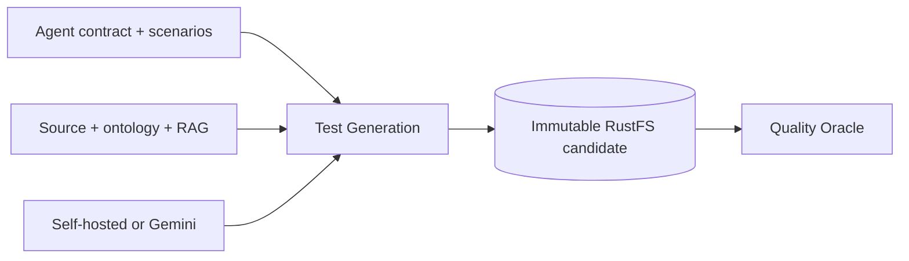

# Test Generation Agent

Compiles declared contracts or uses the configured local/Gemini model to generate atomic tests grounded in scenarios, source, ontology, and optional RAG evidence.

**Contract:** `generate_tests` · `POST /generate_test_plan` · port `8001`.

`GET /health` reports sanitized provider mode, model, connectivity, and latency. Missing execution contracts are reported as requirements needed, never guessed.
