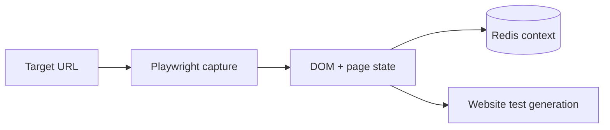

# Webpage State Capture Agent

Captures browser-observable page state for website test generation and stores bounded context in Redis.

**Contract:** `capture_state` · `POST /capture` · port `8002`.

Navigation is network-active. Allow only reviewed targets and use disposable candidate environments for smoke tests.
