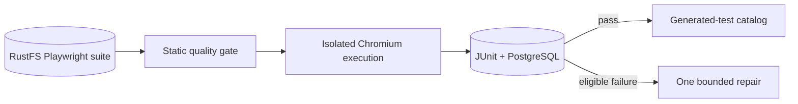

# Website Test Execution

Runs quality-gated Playwright pytest suites against declared website targets and persists deterministic browser evidence.

**Contracts:** `qe.validate`, `qe.repair` · `POST /run_tests` · port `8013`.

The browser image is a separate policy boundary from agent test execution. Authentication is injected at runtime and never written into generated tests.
