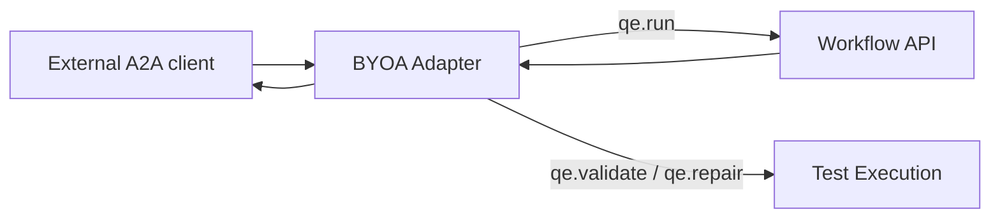

# BYOA Adapter

Normalizes external Agent Cards and translates JSON-RPC `tasks.execute` calls into AQE workflow, validation, and repair operations.

**Contracts:** `qe.run`, `qe.validate`, `qe.repair` · port `8009`.

The adapter is a protocol boundary, not a credential store. Target authentication is supplied through runtime policy.
