# AQE Automata Architecture and Operating Rules

This document is the authoritative design reference for AQE. AQE is a
**compound agent system** exposed to a larger platform as one quality-engineering
specialist. “AQE Automata” is the product name for the durable state machine
that generates, executes, diagnoses, repairs, evaluates, and catalogs tests.

## 1. System context

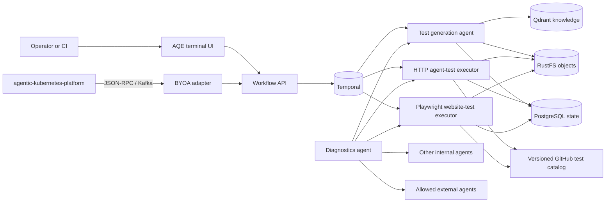

### Ownership rules

| Component | Owns | Must not own |
|---|---|---|
| BYOA adapter | Platform discovery, Kafka envelope normalization, correlated result publication | Test generation or execution logic |
| Temporal workflow | Durable ordering, activity timeouts, retries, workflow identity | Test source or infrastructure credentials |
| Generation agent | RAG grounding and domain-neutral Python test generation | Silently changing results after execution |
| Agent executor | Browser-free HTTP/Agent Card/A2A tests, static gate, bounded pytest, repair | Installing or invoking browser tooling |
| Website executor | Playwright browser journeys, static gate, bounded pytest, repair | Agent protocol tests that belong in the HTTP runtime |
| Diagnostics agent | Agent Card/skill contract checks, safe retry, recommendations | Unapproved restarts or cluster mutation |
| PostgreSQL | Mutable run state and queryable audit metadata | Large source or evidence blobs |
| RustFS | Generated/repaired source and large evidence | Workflow state transitions |
| GitHub catalog | Validated, passing tests grouped by agent version | Secrets or unvalidated model output |

### Repository and deployment boundaries

Every box under `agents/` is independently buildable and has one checked-in
`agent.yaml` contract. Shared utilities are copied only into images that use
them. Temporal, BYOA, reporting, and the frontend are control-plane components,
not mislabeled internal agents.

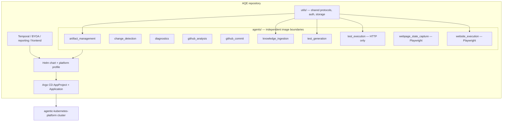

The default NetworkPolicy permits AQE-internal calls, DNS, explicit platform
dependency ports, Kafka in `messaging`, Temporal/RustFS service ports, and HTTPS
for allowlisted external targets. Pods run without service-account tokens, as a
non-root user, with `RuntimeDefault` seccomp, dropped capabilities, read-only
root filesystems, and bounded temporary volumes where execution requires them.

## 2. End-to-end QE automaton

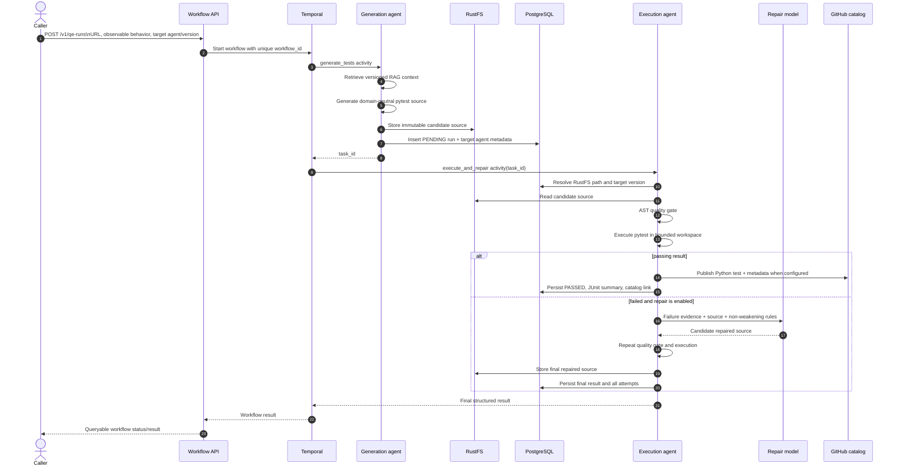

## 3. Temporal rules

Temporal is the durable coordinator, not a replacement for agent logic.

| Rule | Implemented behavior | Reason |
|---|---|---|
| Workflow identity | Caller may supply `workflow_id`; otherwise the API creates `qe-<uuid>` | Enables idempotent caller-controlled submission |
| Generation retries | `maximum_attempts=1`, three-minute timeout | Generation persists a new artifact and is not idempotent yet |
| Execution retries | `maximum_attempts=2`, fifteen-minute timeout, two-minute heartbeat timeout | A transient dispatch failure may recover; execution state remains keyed by `task_id` |
| Repair attempts | Execution agent allows `MAX_REPAIR_ATTEMPTS` (default 2) inside one activity | Repair needs complete prior-attempt evidence and a strict bound |
| Activity boundary | Network and database work lives in activities, never workflow code | Keeps workflow replay deterministic |
| Payload rule | Workflow state carries IDs and small JSON; source remains in RustFS | Avoids oversized Temporal histories |
| Cancellation | Worker cancellation stops orchestration; execution subprocess has its own timeout and limits | Durable cancellation and sandbox control are separate concerns |
| Future idempotency | Add a generation idempotency key before enabling generation activity retries | Prevents duplicate artifacts and catalog entries |

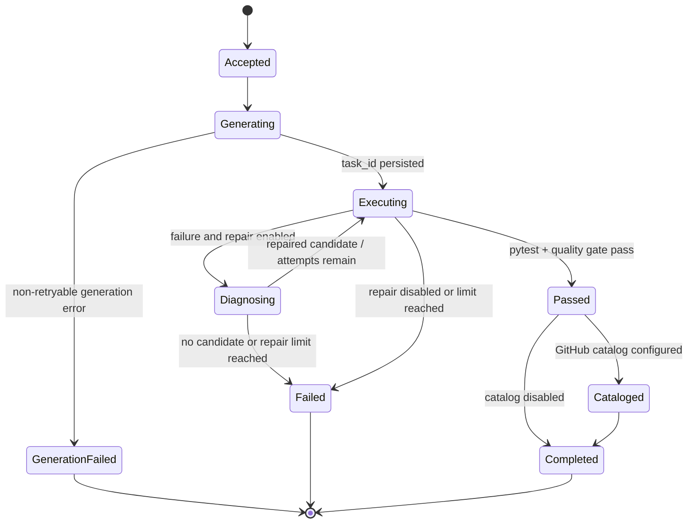

## 4. Generated-test rules

1. Tests are executable Python `pytest` files.
2. `test_type=website` routes browser journeys to the Playwright image;
   `test_type=agent` routes Agent Card, A2A, JSON-RPC, API, and orchestration
   tests to a browser-free Python/httpx image. The runtimes reject mismatched jobs.
3. Every `test_` function verifies one observable outcome with one Python
   `assert` or Playwright `expect`.
4. Shared setup belongs in fixtures; tests do not rely on execution order.
5. Fixed sleeps, swallowed assertion failures, conditional assertion skipping,
   and weakened expected values are forbidden.
6. Expected behavior comes from the supplied card, skills, scenario, product
   evidence, and golden data—not from a hard-coded profession.
7. Passing source is committed to the versioned GitHub green catalog only after
   the static gate and runtime execution pass.
8. A failed test enters the GitHub findings catalog only after explicit defect
   confirmation with evidence and a clean assertion-only reproduction. Quality,
   collection, environment, and runtime errors are never product findings.

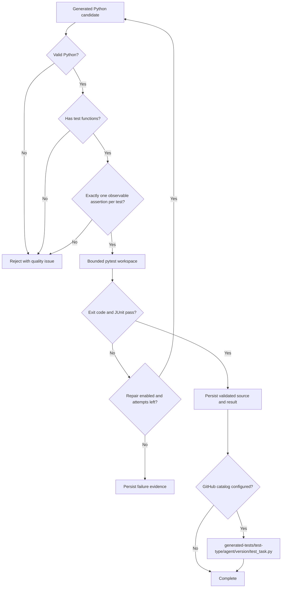

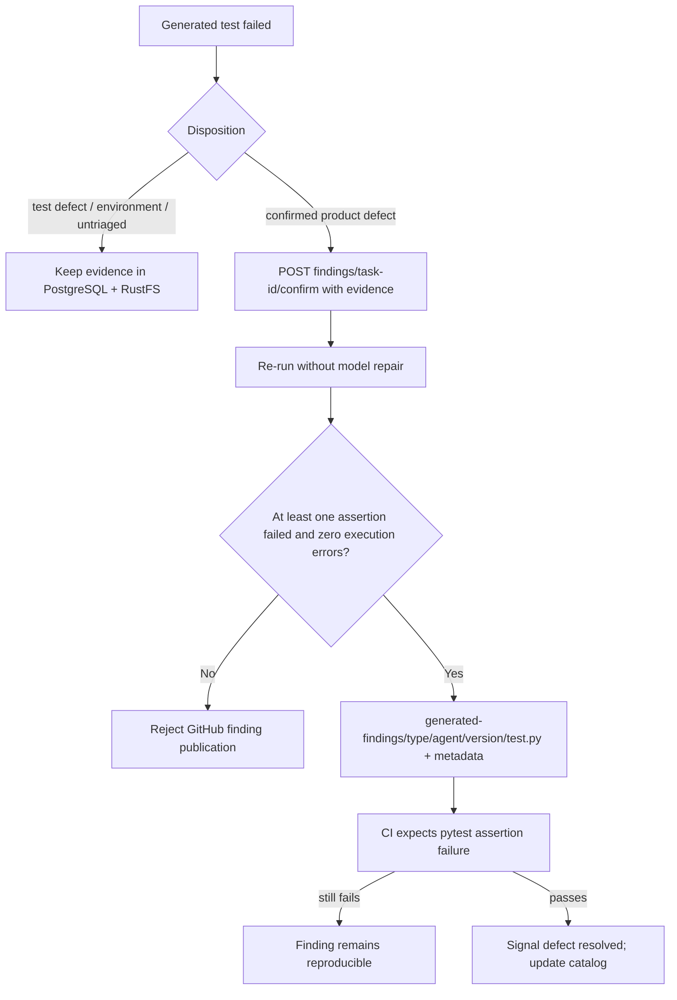

### Runtime and authentication boundary

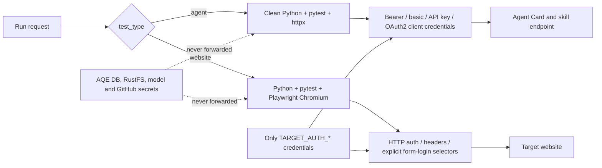

Generated tests run with only explicitly allowlisted target variables. In
GitHub, both catalogs use the protected `generated-agent-e2e` Environment so a
repository administrator can require approval before target credentials reach
generated code.

## 5. Agent ontology and RAG grounding

`ontology/agent_ontology.json` is a versioned source of truth. It classifies
agents across interaction style, interface, autonomy, sensitivity, and impact;
defines universal obligations; and supplies archetype/risk-specific scenarios.
Initial archetypes cover conversational, teaching/coaching,
listening/transcription, finance, insurance, healthcare, retrieval/research,
side-effecting action, multi-agent orchestration, and website/browser systems.

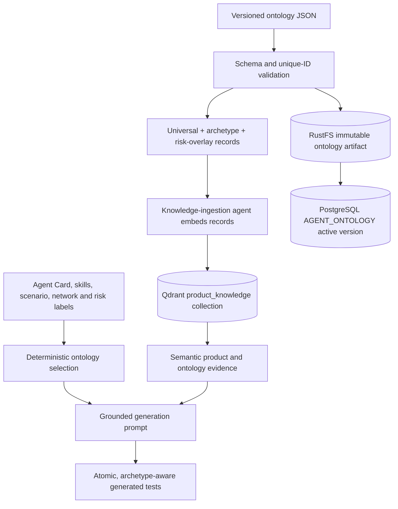

Product ingestion replaces only `source=product_knowledge` vectors; ontology
ingestion replaces only `source=agent_ontology`. It never recreates the shared
collection. Argo CD runs ontology ingestion after sync, and the generator also
loads applicable ontology rules deterministically so test obligations are not
left solely to model retrieval quality.

### GitHub source-analysis evidence

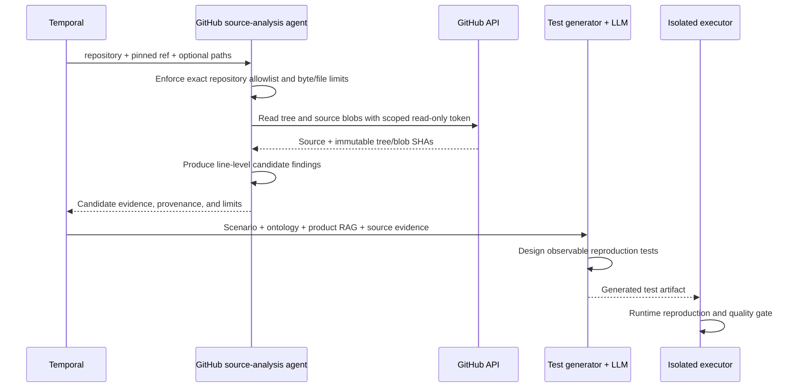

Source inspection is read-only and opt-in. `GITHUB_SOURCE_ALLOWED_REPOSITORIES`
must contain exact `owner/name` entries; `GITHUB_SOURCE_TOKEN` should be a
fine-grained contents-read token. AQE never calls source evidence a product
defect by itself: candidates must become observable tests and pass the confirmed
finding publication gate.

## 6. Internal and external agent validation

The diagnostics agent accepts only `http` or `https` URLs without embedded
credentials. Hosts must be present in `AGENT_PROBE_ALLOWED_HOSTS`; this prevents
the probe API from becoming an unrestricted server-side request primitive.

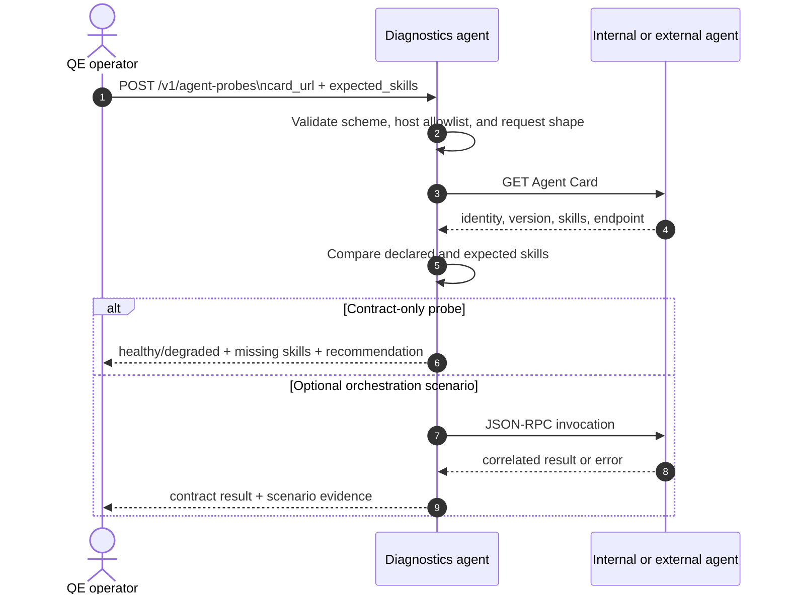

### Internal AQE fleet scan

```json
{
  "artifact-management": "http://aqe-artifact-management:8007/agent_card",
  "test-generation": "http://aqe-test-generation:8001/agent_card",
  "test-execution": "http://aqe-test-execution:8003/agent_card",
  "website-execution": "http://aqe-website-execution:8013/agent_card",
  "aqe-byoa": "http://aqe-byoa:8009/.well-known/agent.json"
}
```

Argo CD runs infrastructure checks as a `PreSync` hook and Agent Card checks as
a `PostSync` hook. The long-running diagnostics agent powers the UI and returns
recommendations. Its safe-heal action retries failed checks once; workload
restarts require a separate, explicitly authorized platform operation.

### External teaching-agent example

The same contract works for teaching, listening, finance, insurance, or any
other profession. The domain appears in the target agent's contract—not in AQE
code.

```json
{
  "name": "algebra-tutor",
  "card_url": "https://agents.school.example/.well-known/agent.json",
  "expected_skills": ["lesson.explain", "assessment.grade"],
  "invocation": {
    "url": "https://agents.school.example/rpc",
    "method": "tasks.execute",
    "params": {
      "skill": "lesson.explain",
      "context": {
        "learner_level": "grade-8",
        "topic": "linear equations",
        "observable_outcome": "explanation includes one worked example and a check-for-understanding"
      }
    }
  }
}
```

For versioned generation, pass the discovered identity alongside the scenario:

```json
{
  "url": "https://agents.school.example/rpc",
  "agent_card_url": "https://agents.school.example/.well-known/agent.json",
  "target_agent": {"id": "algebra-tutor", "version": "3.4.1"},
  "skills": ["lesson.explain", "assessment.grade"],
  "agent_archetype": "teaching_coaching",
  "network_scope": "external",
  "risk_labels": ["personal", "moderate"],
  "test_type": "agent",
  "spec": "Verify a grade-8 linear-equation explanation returns one worked example and one independent check-for-understanding.",
  "repair": true
}
```

After a passing run, AQE publishes:

```text
generated-tests/agent/algebra-tutor/3.4.1/test_<task-id>.py
generated-tests/agent/algebra-tutor/3.4.1/test_<task-id>.json
```

## 7. Live topology and test graph

The diagnostics agent exposes `GET /v1/graph` in the same `{nodes, edges,
stats}` shape used by the platform knowledge-graph visualizer. It merges live
fleet scans, discovered external agents, infrastructure, and recent generation
events. The terminal UI polls every five seconds, animates newly generated test
edges, and shows identity, version, skills, ontology archetype, and status on
selection.

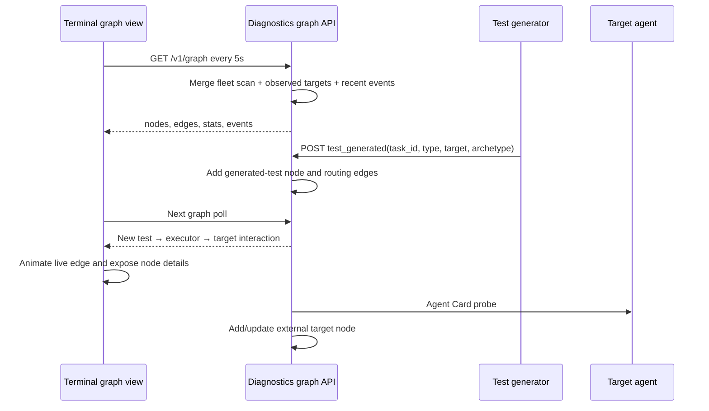

Recent generation events are intentionally bounded in memory. PostgreSQL and
RustFS remain the durable audit sources; a future high-volume graph can project
the same events into a dedicated graph store without changing the API.

## 8. BYOA platform flow

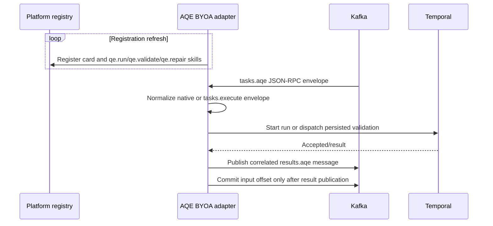

## 9. CI, continuous testing, CD, and GitOps

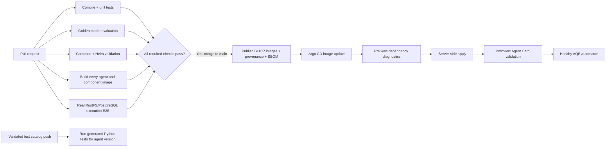

### Deployment invariants

- The official `rustfs/rustfs` image provides S3-compatible object storage.
- Runtime secrets come from `aqe-runtime-secrets`; they are not committed.
- Argo CD uses automated prune/self-heal and server-side apply.
- PreSync diagnostics must pass before workloads update.
- PostSync Agent Card validation must pass before the sync is considered healthy.
- External probe hosts are allowlisted per environment.
- Publishing tests requires a scoped GitHub token with contents write access to
  the selected catalog repository. Generated-test CI has read-only repository
  permissions; target credentials are available only through the protected
  `generated-agent-e2e` Environment when its secrets are configured.

## 10. Failure and recovery procedure

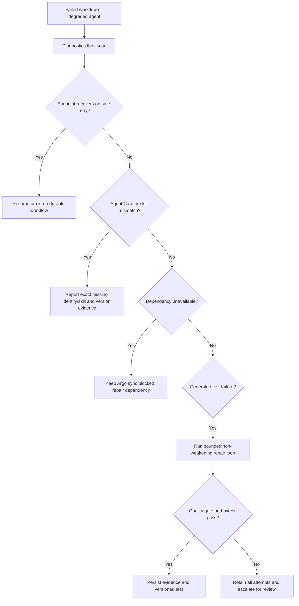

AQE never interprets a retry as permission to mutate shared infrastructure.
Cluster restarts, deployments, and external writes remain explicit platform
operations with their own authorization and audit trail.
