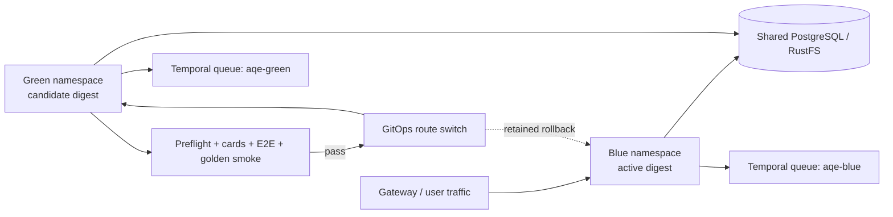
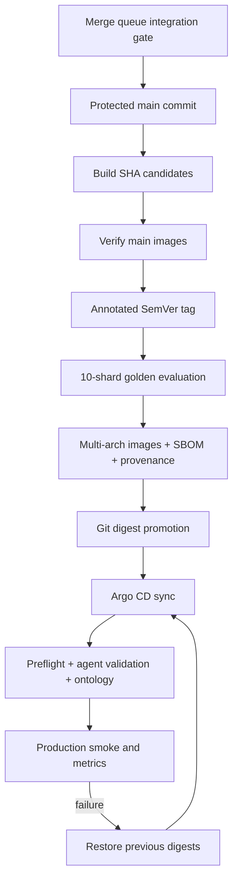

# Production release

AQE uses trunk-based development: the protected `main` branch is the integration
branch and must remain releasable. Production promotion is tag-driven; AQE
releases immutable multi-architecture images to GHCR and a Helm chart through
GitHub Actions.

```mermaid
flowchart LR
    A[Feature PR] --> B[Path-aware PR checks]
    B --> C[Merge queue]
    C --> D[Temporary merge_group commit]
    D --> E[Full integration gate]
    E --> F[Protected main]
    F --> G[Immutable SHA candidate]
    G --> H[Candidate environment]
    H --> I[Complete contracts + passing Autopilot + catalog CI]
    I --> J[Approval-protected SemVer tag]
    J --> K[GA gates and artifacts]
    K --> L[GitOps production promotion by digest]
```



Superseded runs on the same PR are cancelled. Each GitHub-hosted job is isolated;
do not point PR tests at a shared mutable AQE environment. The stable gate
aggregates unit, evaluation, Helm/Argo CD, affected-image, and runtime E2E
checks. Docs-only PRs do not consume every image builder or a full E2E
environment. For cluster-level preview tests, create one namespace per PR
(`aqe-pr-<number>`) and delete it when the PR closes.

CI handles `merge_group`, allowing a merge queue to validate the exact combined
commit without forcing hundreds of authors to continually rebase. Configure
queue concurrency to match runner and model capacity; queueing 1,000 PRs is
safe, launching 1,000 simultaneous model evaluations is not. If the GitHub plan
does not expose merge queues, retain protected squash-only PRs and require
branches to be current before merge.

Image matrices are path-selected and bounded to six parallel builds per run.
Live evaluation defaults to two concurrent shards and can be tuned with the
`EVAL_MAX_PARALLEL` repository variable. GitHub-hosted capacity absorbs short
jobs; expensive model and E2E work stays behind the merge queue, schedule, or
release tag. Raise these limits only after measuring registry, runner, cluster,
and model-endpoint saturation.

## Verification lanes

CI derives the lane from changed paths; a PR label cannot downgrade required
coverage.

| Lane | Typical changes | Required verification |
|---|---|---|
| Docs | `README.md`, `docs/`, templates | Whitespace, policy-script, and YAML validation |
| Config | Helm, Argo CD, Compose | Fast validation plus Helm rendering and deployment-policy checks |
| Code | Features, fixes, refactors, dependencies, workflows | Unit and golden evaluation, contracts, affected images, and runtime E2E when applicable |

Refactors use the code lane because “no intended behavior change” requires more
regression evidence, not less. Features and fixes must carry unit tests and
contract or integration coverage for every changed public boundary. The pull
request template records the change type, affected target, rollback, contract
impact, and verification evidence.

## One-time repository setup

In **Settings → Branches / Rulesets**, protect `main`: require pull requests,
**CI / ci-gate**, merge queue, current branches, and conversation resolution;
block force-pushes and deletion. Keep `main` as the default PR target. Use
CODEOWNERS approval when eligible reviewers exist; until then, do not configure
an impossible reviewer count.

Add a tag ruleset for `v*` that blocks deletion and updates and restricts tag
creation to the promotion workflow or release administrators. Otherwise, a
direct tag push could bypass `promote-release.yml`.

Configure the GitHub `release` environment with required reviewers. Set
`E2E_RUNNER` to a hardened self-hosted runner label that has read-only access to
the candidate cluster; a GitHub-hosted runner cannot verify a private Kind or
internal Kubernetes environment. Keep cluster credentials in the environment's
secret manager, never in repository variables or committed values.

The `merge_group` ref is the disposable integration branch. It tests the exact
batch GitHub intends to merge, then disappears. This avoids a permanent
`develop` branch, duplicate release PRs, back-merges, and environment drift.
Development Argo CD may follow immutable `sha-*` candidates from `main`; staging
may use `vX.Y.Z-rc.N`; production only accepts a final `vX.Y.Z` digest.

## Release procedure

1. Queue a feature PR only after its required checks pass. The queue reruns
   **CI / ci-gate** on the synthetic integration commit before merging to `main`.
2. Confirm the resulting `main` **Build and publish** run succeeds. Use the
   exact merged SHA rather than local branch state:

   ```bash
   git fetch origin
   candidate_sha=$(git rev-parse origin/main)
   run_id=$(gh run list --commit "$candidate_sha" --workflow release.yml \
     --limit 1 --json databaseId --jq '.[0].databaseId')
   test -n "$run_id"
   gh run watch "$run_id" --exit-status
   ```
3. Deploy that exact `sha-<short-commit>` candidate through Helm/Argo CD and run
   Autopilot against the candidate. Every executable child must pass; missing
   contracts remain release blockers rather than skipped successes.

   For the current Helm-managed candidate cluster, use the checked-in deployer
   instead of hand-writing 18 image overrides:

   ```bash
   scripts/deploy-candidate.sh "$candidate_sha"
   ```

   Production should keep image values in Git and let Argo CD reconcile them;
   the script is only for the candidate environment and still verifies main
   ancestry. A successful script run is a deployment, not a production release.
   Do not interrupt Helm; if interrupted, recover the pending release with
   `helm history` and a rollback before retrying.
4. Confirm discovery reports every scenario executable with a semantic oracle,
   then run a fresh Autopilot campaign against that exact candidate. Temporal
   `COMPLETED` means orchestration returned; qualification additionally requires
   `result.successful: true`, zero failed children, and a catalog commit for
   every successful child. Old or terminated fleet IDs are not evidence.
5. Require **Versioned agent E2E catalog** to pass at the current
   `aqe-generated-tests` branch head. This proves the committed generated tests,
   not only their original sandbox execution.
6. Dispatch **Promote verified candidate** with the final version, full candidate
   SHA, fleet workflow ID, and candidate namespace. Configure its `release`
   environment with required reviewers. The workflow re-verifies main ancestry,
   the image-build run, every deployed image tag, pod availability, model
   connectivity, complete discovery contracts/oracles, the durable fleet result,
   and catalog CI before creating the annotated tag:

   ```bash
   gh workflow run promote-release.yml \
     -f version=vX.Y.Z \
     -f candidate_sha=$(git rev-parse origin/main) \
     -f fleet_workflow_id=qe-fleet-... \
     -f namespace=aqe
   ```

   Production promotion must wait for the tag-triggered **Build and publish**
   workflow to finish successfully, not merely for tag creation.
7. The tag workflow rejects tags not reachable from `main`, aliases the already
   verified multi-architecture `sha-*` manifests with the final SemVer tag
   without rebuilding them, then creates a
   GitHub Release containing the Helm chart and
   checksum only after all ten live model-evaluation shards and the disposable
   Compose integration/telemetry environment pass. Offline dataset validation
   is useful in ordinary CI but cannot satisfy the GA model gate. Download the ten
   `model-evaluation-shard-*` artifacts, verify SBOM/provenance attestations and
   both `linux/amd64` and `linux/arm64` image manifests. Promote Argo CD values
   by immutable tag or digest; never promote `main`.
8. Submit a reviewed Git change that pins production to the released image
   digests and let Argo CD reconcile it. Never run
   `scripts/deploy-candidate.sh` against production and never deploy a mutable
   branch tag.
9. Confirm Argo CD sync, preflight, Agent Card validation, ontology ingestion,
   golden evaluation, metrics, and one agent plus one website smoke journey.
10. Roll back by restoring the previous image digests in Git and letting Argo CD
   reconcile. Preserve PostgreSQL/RustFS evidence and open an incident issue.

This follows common build-once/promote-many practice: CI creates immutable
artifacts once, candidate environments exercise those exact artifacts, an
approval-protected promotion records the evidence, and production consumes the
same digest. Generated tests are treated as a versioned test product with their
own CI signal; they are not copied into a release merely because generation
completed.

Configure `RELEASE_SLACK_WEBHOOK_URL` as a GitHub Actions secret to publish the
final GA, live-model, integration, image, and chart results to the release
channel. Absence of the optional webhook does not weaken a release gate; GitHub
remains authoritative. Treat notification delivery as an operational SLI and
alert on repeated failures.

Track at least deployment success rate, change failure rate, rollback time,
escaped defects, test duration, flaky-test rate, model score, model latency, and
agent-test pass rate. Set SLOs from measured baselines, review them regularly,
and move slow suites behind affected-path or merge-queue boundaries rather than
allowing engineers to bypass deterministic checks.

## Blue/green promotion

Run blue and green as separate Helm releases/namespaces with different Temporal
task queues. Sharing `aqe-workflows` would let old and new workers consume each
other's tasks, so the chart exposes `config.temporalTaskQueue` for slot isolation.



Install the candidate with immutable digests, validate it directly, then change
the platform Gateway/HTTPRoute backend in Git from blue to green. Do not switch
traffic by changing pod labels imperatively. Keep blue running for the rollback
window, and require backward-compatible database migrations while both slots
exist. A failed check leaves the route on blue; rollback is the inverse Git
route change. Example slot installs:

```bash
IMMUTABLE_VALUES=/secure/path/aqe-vX.Y.Z-digests.yaml
helm upgrade --install aqe-blue deploy/helm/aqe -n aqe-blue --create-namespace \
  -f deploy/helm/aqe/values-agentic-platform.yaml -f "$IMMUTABLE_VALUES" \
  --set config.temporalTaskQueue=aqe-blue
helm upgrade --install aqe-green deploy/helm/aqe -n aqe-green --create-namespace \
  -f deploy/helm/aqe/values-agentic-platform.yaml -f "$IMMUTABLE_VALUES" \
  --set config.temporalTaskQueue=aqe-green
```



Do not publish from a dirty tree, move an existing release tag, bypass CI, or put
production credentials in GitHub variables, Helm values, logs, or test evidence.

For a private model endpoint, register an isolated GitHub Actions runner on a
host that can reach it with custom label `aqe-model`, then set repository
variable `EVAL_RUNNER=aqe-model`.
Use the runner package matching the host architecture (for Apple Silicon,
`actions-runner-osx-arm64-*`), keep it out of the repository checkout, and use a
fresh short-lived registration token. Never paste that token into issues, pull
requests, logs, committed files, or chat. A single runner executes matrix shards
sequentially; add identically secured runners only when the model can sustain
parallel evaluation traffic.
