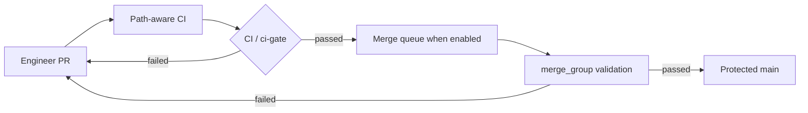
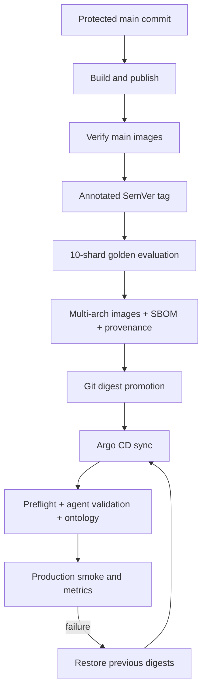

# Production release

AQE releases immutable multi-architecture images to GHCR and a Helm chart as a
GitHub Actions artifact. Production promotion is tag-driven.



Superseded runs on the same PR are cancelled. The stable gate aggregates unit,
evaluation, Helm/Argo CD, affected-image, and runtime E2E checks; docs-only PRs
do not consume 14 image builders or a full E2E environment. CI handles the
`merge_group` event so a GitHub merge queue can validate combined changes
without forcing hundreds of authors to continually rebase against a busy
`main` branch. If the repository plan does not expose merge queues, retain the
protected squash-only PR flow and enable the queue when it becomes available.

1. Open a pull request to `main`; obtain approval and a green **CI / ci-gate**.
2. After merge, confirm the `main` **Build and publish** run succeeds.
3. Create an annotated SemVer tag from the verified commit and push it:

   ```bash
   git switch main && git pull --ff-only
   git tag -a vX.Y.Z -m "AQE vX.Y.Z"
   git push origin vX.Y.Z
   ```

4. The tag workflow creates a GitHub Release containing the Helm chart and
   checksum only after all ten golden-evaluation shards pass. Download the ten
   `model-evaluation-shard-*` artifacts, verify SBOM/provenance attestations and
   both `linux/amd64` and `linux/arm64` image manifests. Promote Argo CD values
   by immutable tag or digest; never promote `main`.
5. Confirm Argo CD sync, preflight, Agent Card validation, ontology ingestion,
   golden evaluation, metrics, and one agent plus one website smoke journey.
6. Roll back by restoring the previous image digests in Git and letting Argo CD
   reconcile. Preserve PostgreSQL/RustFS evidence and open an incident issue.



Do not publish from a dirty tree, move an existing release tag, bypass CI, or put
production credentials in GitHub variables, Helm values, logs, or test evidence.

For a private model endpoint, register an isolated GitHub Actions runner on a
host that can reach it with custom label `aqe-model`, then set repository
variable `EVAL_RUNNER=aqe-model`.
Use the runner package matching the host architecture (for Apple Silicon,
`actions-runner-osx-arm64-*`), keep it out of the repository checkout, and use a
fresh short-lived registration token. Never paste that token into issues, pull
requests, logs, committed files, or chat. A single runner executes matrix shards
sequentially; add identically secured runners only when the model can sustain
parallel evaluation traffic.
